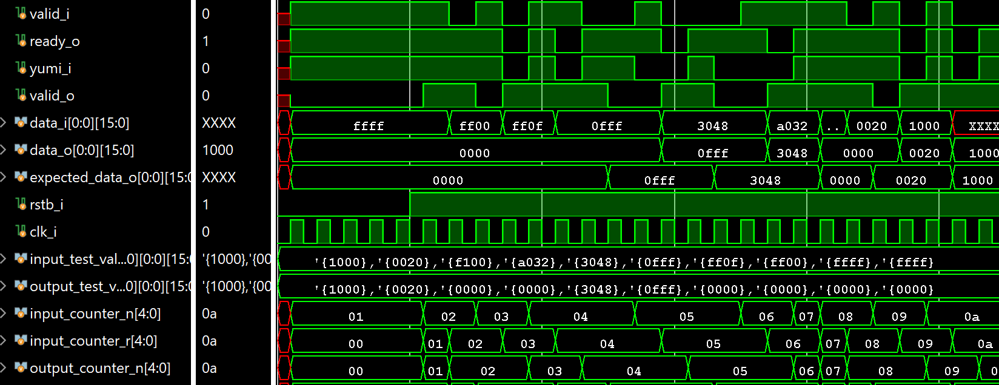
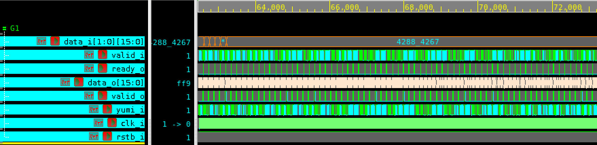

# EECS 598 Group Project
Version control for EECS 598 at UMich (go blue!)

[Video Walkthrough](https://youtu.be/CqfMzEyPPNQ)

## Directory Structure
The directory is structured carefully, and there are a lot of files. However,
there are some things to keep in mind.
1. The only HDL files that are tracked are the Vivado `.xpr` file, the
`hdl_design.srcs` folder, and the source files in the `pdk_mem` directory.
2.  The only folder in `hdl_design.srcs` that contains design files is in the
`design_sources` directory. Each testbench, runnable in Vivado, is a fork of
the `template_tb` testbench, which is a template we used.
3. Tests are done by generating .mem files for input and expected outputs in
Python, which the `template_tb` directory is written for.
4. Memories are initialized as ROMs using `.mem` files, which are synthesizeable using Vivado, but not with VCS. Note: memory naming convention is `j_iii.mem`, where `j` is the layer number (passed as a parameter during instantiation) and `iii` represents the matrix row. LSTM layers in design are matrices 4-7, since there are 4 separate matrices.
5. It is possible to run tests using VCS, but **only if they do not require mem files for matrix multiplication**. So the AFB and MAC testbenches will work in VCS, but LSTM and FC testbenches will not.
6. When running tests, remove all `.mem` files from the Vivado design sources. The reason is that by default, Vivado adds all design sources to all simulation sets, and design `.mem` files will interfere with test `.mem` files. Make sure to add them back
for Vivado synthesis so that the block RAM will actually output the correct weight.
7. Make sure to run `make clean` before pushing to the GitHub repo from CAEN.  

### HDL Directory
The main directory is structured as follows:
```
hdl_design
-- hdl_design.xpr
|- pdk_mem
  |- src
    -- SRAM128x16.config
  |- verilog
    -- SRAM_128x16.v
  -- memgen.sh
|- hdl_design.srcs
  |- *_tb  // standard testbench file structure
    |- sv
      -- *_tb.sv
    |- mem  // test .mem files from Python test scripts go here
      -- *_input.mem
      -- *_output.mem
    |- waveform_config
  |- design_sources
    design_1.bd
    toplevel.v  // used in Vivado block diagram
    pytorch_toplevel.sv  // LSTM followed by 2 FC layers, only in testbench at this time
    |- sources_1
      |- ip
        -- Xilinx block IPs go here
    |- submodules
      |- layers
        -- lstm_layer.sv
        -- fc_layer.sv
      |- mem_init  // .mem files from PyTorch go here
        -- *.mem  // mem files starting with 4-7 should be added to design sources for Vivado synthesis
      |- submodules
        |- afb  // design files for activation function
        |- controllers  // controllers for each layer that line data up for MAC
        |- ideal_blocks  // deprecated, idealized modules used early in development
        |- mac  // BBR MAC design files
        |- memories  // instantiation of block RAM and SRAM here
      -- c_queue.sv  // files handling data transfer
      -- hidden_state_queue.sv
      -- piso.sv
```

### Python Files
All python files are in the `python_scripts` directory.

```
python_scripts
|- eval  // folder for scripts that are only for analyzing simulation outpu
|- MLmodel  // PyTorch model
|- test_input_gen  // for generating inputs to testbenches and some analysis
|- test_install  // folder for ensuring libraries are imported correctly
|- utils  // library of fixed point functions that match hardware
  -- cordic_dnn_operations.py  // functions for computing with CORDIC MAC and AFB
  -- CORDIC.py // reference object definition for CORDIC in fixed point
  -- fp_logic.py // basic fixed-point math (quantize, add, mult)
  -- write_mem_utils.py  // library for writing matrices and vectors to files
-- environment.yaml
```

### Synthesis using Synopsis
All you need to do to run synthesis using Design Compiler is run `make syn`
at the toplevel of the folder. It will regenerate the necessary SRAM and then
run synthesis using the scripts in the `synth_scripts` directory.

## Installation Instructions
You must have Anaconda (Miniconda recommended) and Xilinx Vivado installed. We are designing for the ZCU104 development board. We also are designing assuming the 598-002
module is loaded in CAEN.

### Git Repository Setup
If you do not have Git installed, you can do so from the [Git for Windows](https://gitforwindows.org/) website. Once that is done, you will have to set up the SSH key to be able to make commits to Git from the command line of your local machine (this works for the CAEN labs too). Once git is installed, run the following lines in the Git command line:
```
cd ~
ssh-keygen -t rsa -b 4096 -C "YOUR_EMAIL@EMAIL.COM"
```
Enter 'y' for a blank passphrase (it will break things otherwise). Once it is finished generating, enter
```
cat ~/.ssh/id_rsa.pub
```
and the text of the public RSA key will be shown.

Once you have copied the RSA key, go to your settings in GitHub, under "SSH and GPG Keys". Click the green button labeled "New SSH Key" and paste the key, and give it an informative title, like "CAEN Lab Key" or "Laptop Key", depending on your location.

Now, you can clone the repository. Go to the eecs598 repository home page, and click on the green button labeled `code` as shown below:


Then, on your machine where you want to clone the repository, clone using the following command:

```
git clone git@github.com:Codax2000/eecs598.git "FOLDER NAME"
```
You can insert your own folder name if you don't want the folder to be called `eecs598`. You are now ready to use Git for version control for this repository. Useful commands are:

| Command | Use |
| ------- | ------- |
| `git pull` | Pull most recent changes from the repository |
| `git add .` | Stage all changed files for commmit (except those in .gitignore) |
| `git commit -m "comment here"` | Commit branch for push with a comment of changes |
| `git fetch origin` | Fetch most recent changes before switching branches |
| `git checkout branch_name` | Checkout the branch `branch_name`. Change `branch_name` based on the GitHub branch. |
| `git branch -d branch_name` | Delete the local branch `branch_name`. Useful when the GitHub branch it's tracking is deleted. |
| `git stash` | Temporarily remove changes so you can restore them later on (useful for moving changes between branches) |
| `git stash apply` | Apply changes from the stach and keep them in the stash |
| `git stash pop` | Apply changes from the stach but clear the stash |


### Python Environment Setup and Testing
Create a new environment for running the required Python scripts, using:
```
cd python_scripts
conda env create -f environment.yml
```

After that, you can use it by running `conda activate eecs598` on the command line. Alternately, if you are using VSCode, install the Python extension and select `View->Command Palette` and then `Python: Select Interpreter->eecs598`. To test the installation, run:
```
cd test_install
python main.py
```
You should see the output:
```
Foo runs, import successful
Main runs, installation successful!
```

However, in general, you should only need `pandas`, `matplotlib`, and `numpy`
to run the scripts. The ML model is done with `PyTorch`.

### Vivado setup and testing
You should be able to run Vivado based in the `vivado_project` folder, which is the toplevel folder for the FPGA design. Note that only the project structure and the source files are kept when you push due to the .gitignore file, so you will have to recompile upon cloning or pulling from the repository.

When opening the project for the first time, you should navigate to the `vivado_project` folder and open the `vivado_project.xpr` file, and Vivado should open the rest. To test that the project runs correctly, run the `template_tb` simulation, which runs a ReLU layer, and you should see this waveform and text in the terminal saying that 10
tests have passed.



You can also test that the VCS simulator is running by loading the modules from the eecs598 directory and running `make dve` in the toplevel directory. You will need to change the Makefile depending on the files you want to compile, but it should be
pretty straightforward to run. This is one of the AFB waveforms:



There is a folder for design sources (generally module files), which has
directories inside it for various RTL submodules and for model .mem files. Please add new
design files to either the `layers` or `submodules` directories, since we want
the directory to be clean and legible.

Each simulation you would like to save should have its own folder, each of
which maps to a simulation set in Vivado.

### GitHub Style
- Please open a new issue, and GitHub will create an associated branch. This will make things easy to document and track what's going well or not.
- Before merging branches, kindly give others a heads up about the changes. We can do code reviews if we feel like it.

### Python Style
- Up to you, but probably stick to `flake8` linting standards
- Please make sure you have function and file comments

### Vivado Best Practices
- Git only tracks the `.xpr` project file and the `vivado_project.srcs` folder. If there are any other folders that Git starts tracking (except for eventual physical constraints), please add them to the .gitignore file.
- Have a separate simulation set for each simulation you want to run. This ensures you can still go back and debug if a higher-level simulation goes wrong.
- If you would like to run simulations with VCS instead of Vivado, the Makefile is present in the directory, please use and update as necessary. One current problem is making sure `.mem` files are correctly read and saved. 
- Use Vivado IP where possible, especially with multiply-accumulate functions. Vivado has a DSP slice macro that can make life much easier, in addition to block memories that can take `.mif` files, so we won't have to write anything.
- Prefer `generate` blocks and formulas over large lookup tables. If you can generalize, you will have to debug less.

Creating a new simulation set is easy, but please be careful to keep things clean. To create a new simulation set:
1. Copy the `template_tb` directory and add/change files as necessary, including writing `.mem` files. Please stick to the directory structure.
1. Under the `Sources` tab, click the `+` button.
1. Select the **Add or create simulation sources** radio button
1. Select **Create Simulation Set** from the dropdown and enter the name of your new simulation set
1. Click on `Add Files`, and select the all the files from your new directory. Note: you will likely have to select the `.mem` files manually, since Vivado will not add them automatically.
1. Unless you are running toplevel simulations, make sure the **Include all design sources for simulation** checkbox is **unchecked**. This keeps the directory readable.
1. Manually add whatever design sources you need. Yes, this is a little tedious, but it keeps things legible.
1. To run your new simulation set, right-click the testbench module you created (or copied) and click **Set as Top**, then right-click on the simulation set itself and select **Make Active**. Click **Run Simulation** on the far left, and select the appropriate simulation to run.
1. If you want to save a particular set of waves to look at with each run, you can save a waveform configuration file, if you don't already. You will have to add it to your simulation set just like other files.
1. If you want to use the `output.csv` file to run analysis, you will find it in the `hdl_design.sim` folder, which is by default ignored when pushing to GitHub. Please copy it to the `python_scripts/eval` directory to use it and push it to GitHub.

### SystemVerilog Coding Standards
- Please add module headers with your name, the date of modification, and a brief description of the file, including detailed descriptions of inputs and outputs, such that a user can treat your module as a black box and that it works.
- Other than that, please reference and use the BaseJump SystemVerilog coding guidelines. We will not be using the BaseJump STL library (for now), but please pay careful attention to the sections titled **Employ Latency Insensitive Interfaces** and **Coding Style**.
- For documenting design decisions, please use the Issues page to reference what you are working on at the current moment and the fixes you have gone through. Please upload proof of bug fixes when making a Pull Request (such as a Verilog waveform from Vivado).

### Simulating with VCS
The Makefile is set up for use with VCS, but to use it, you will have to be careful with your definitions. We use `define` statements to get this to work in both VCS and Vivado, since Vivado can manage paths, and VCS can't. When copying a testbench, it is critical that you copy over the `define` statements too, or both Vivado and VCS could break. The definitions are as follows:

```c
`ifndef SYNOPSIS
`define VIVADO
`timescale 1ns/10ps
`endif
```

Since the Makefile will define `SYNOPSIS` if we are using VCS, we want to ensure `VIVADO` is defined if we are using Vivado. If `VIVADO` is defined, then we want to set the timescale (VCS breaks if we define the timescale there).

Also, if using VCS, your testbench file will have to specify full relative paths to any files, instead of just file names (because VCS can't manage files the same way Vivado can). The template testbench saves `output.csv` to the `python_scripts` directory, where Vivado saves it to the `hdl_design.sim` directory, and, consequently, it is ignored by GitHub.

## Toplevel Testbenches
`toplevel_tb` and `pytorch_tb` both test based on error from the PyTorch model,
rather than the assertion testing of other tests.

`toplevel_tb` tests 2000 input vectors with expected outputs; that is, there
are 80,000 test cases that were generated with some ideal fixed-point calculations,
and so they do not use assertion testing. Instead, the outputs are captured in
a csv file in the `hdl_design.sim` directory. To run analysis, the
`python_scripts/eval/eval_toplevel_quant_error.py` is run, and it plots and
saves the error in a histogram.

`pytorch_tb` goes one step further, actually making predictions based on the
2000 input vectors above, similarly reading and plotting from the `output.csv`
file, but also copying it to the `eval` directory for later analysis and
comparison.