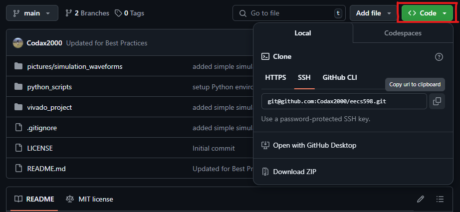
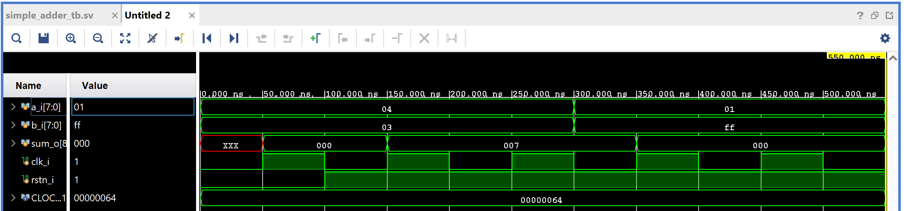
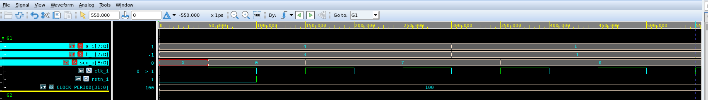

# EECS 598 Group Project
Version control for EECS 598 at UMich (go blue!)

## Installation Instructions
You should have Anaconda (Miniconda recommended) and Xilinx Vivado installed. We are designing for the ZCU102 development board.

### Git Repository Setup
If you do not have Git installed, you can do so from the [Git for Windows](https://gitforwindows.org/) website. Once that is done, you will have to set up the SSH key to be able to make commits to Git from the command line of your local machine (this works for the CAEN labs too). Once git is installed, run the following lines in the Git command line:
```
cd ~
ssh-keygen -t rsa -b 4096 -C "YOUR_EMAIL@EMAIL.COM"
```
Enter 'y' for a blank passphrase (it will break things otherwise). Once it is finished generating, enter
```
cat ~/.ssh/id_rsa.pub
```
and the text of the public RSA key will be shown.

Once you have copied the RSA key, go to your settings in GitHub, under "SSH and GPG Keys". Click the green button labeled "New SSH Key" and paste the key, and give it an informative title, like "CAEN Lab Key" or "Laptop Key", depending on your location.

Now, you can clone the repository. Go to the eecs598 repository home page, and click on the green button labeled `code` as shown below:



Then, on your machine where you want to clone the repository, clone using the following command:

```
git clone git@github.com:Codax2000/eecs598.git "FOLDER NAME"
```
You can insert your own folder name if you don't want the folder to be called `eecs598`. You are now ready to use Git for version control for this repository. Useful commands are:

| Command | Use |
| ------- | ------- |
| `git pull` | Pull most recent changes from the repository |
| `git add .` | Stage all changed files for commmit (except those in .gitignore) |
| `git commit -m "comment here"` | Commit branch for push with a comment of changes |
| `git fetch origin` | Fetch most recent changes before switching branches |
| `git checkout branch_name` | Checkout the branch `branch_name`. Change `branch_name` based on the GitHub branch.
| `git stash` | Temporarily remove changes so you can restore them later on (useful for moving changes between branches) |
| `git stash apply` | Apply changes from the stach and keep them in the stash |
| `git stash pop` | Apply changes from the stach but clear the stash |


### Python Environment Setup and Testing
Create a new environment for running the required Python scripts, using:
```
cd python_scripts
conda env create -f environment.yml
```

After that, you can use it by running `conda activate eecs598` on the command line. Alternately, if you are using VSCode, install the Python extension and select `View->Command Palette` and then `Python: Select Interpreter->eecs598`. To test the installation, run:
```
cd test_install
python main.py
```
You should see the output:
```
Foo runs, import successful
Main runs, installation successful!
```

### Vivado setup and testing
You should be able to run Vivado based in the `vivado_project` folder, which is the toplevel folder for the FPGA design. Note that only the project structure and the source files are kept when you push due to the .gitignore file, so you will have to recompile upon cloning or pulling from the repository.

When opening the project for the first time, you should navigate to the `vivado_project` folder and open the `vivado_project.xpr` file, and Vivado should open the rest. To test that the project runs correctly, run the `sim_1` simulation, which runs a simple 8-bit adder that has an output register, and you should see this waveform:



You can also test that the VCS simulator is running by loading the modules from the eecs598 directory and running `make dve` in the toplevel directory. You will need to change the Makefile depending on the file you want to debug, but for the initial setup, the output should look like the Vivado waveform:



## Best Practices

### GitHub Style
- Please open a new issue, and GitHub will create an associated branch. This will make things easy to document and track what's going well or not.
- Before merging branches, kindly give others a heads up about the changes. We can do code reviews if we feel like it.

### Python Style
- Up to use, but probably stick to `flake8` linting standards
- Please make sure you have function and file comments

### Vivado Best Practices
- Kindly use Vivado to create files. It manages the directory for you and stores it in the `vivado_project.srcs` folder.
- Git only tracks the `.xpr` project file and the `vivado_project.srcs` folder. If there are any other folders that Git starts tracking (except for eventual physical constraints), please add them to the .gitignore file.
- Have a separate simulation set for each simulation you want to run. This ensures you can still go back and debug if a higher-level simulation goes wrong.
- If you would like to run simulations with VCS instead of Vivado, the Makefile from 598 has been modified for that purpose. Please still use Vivado to manage files.
- When writing testbenches, use `assert` statements to compare equality wherever possible so that you don't have to spend time with the waveform viewer. `$display()` statements are your friend, even just to find times and such in complex simulations.
- Use Vivado IP where possible, especially with multiply-accumulate functions. Vivado has a DSP slice macro that can make life much easier.

### SystemVerilog Coding Standards
- Please add module headers with your name, the date of modification, and a brief description of the file, including detailed descriptions of inputs and outputs, such that a user can treat your module as a black box and that it works.
- Other than that, please reference and use the BaseJump SystemVerilog coding guidelines. We will not be using the BaseJump STL library (for now), but please pay careful attention to the sections titled **Employ Latency Insensitive Interfaces** and **Coding Style**.
- For documenting design decisions, please use the Issues page to reference what you are working on at the current moment and the fixes you have gone through. Please upload proof of bug fixes when making a Pull Request (such as a Verilog waveform from Vivado).

